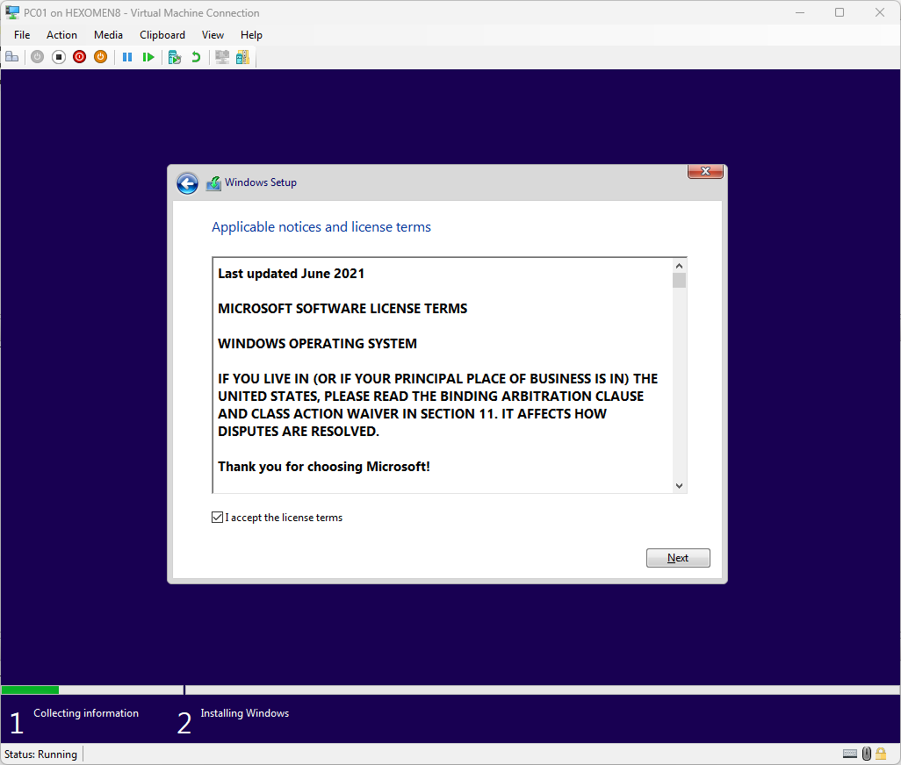

# 使用 Hyper-V 创建虚拟机

## 1. 开启 Hyper-V

### 步骤 1：启用 Hyper-V 功能
Hyper-V 是 Windows 的虚拟化平台，用于创建和管理虚拟机。首先需要确保 Hyper-V 已在系统中启用。

#### 操作步骤：
1. **搜索并打开“增加或删除 Windows 功能”**  
   在 Windows 搜索栏中输入 `Windows 功能`，然后选择“打开”。

   

2. **勾选 Hyper-V**  
   在弹出的窗口中，找到并勾选 `Hyper-V`，然后点击“确定”。

   

3. **重启电脑**  
   系统会提示需要重启电脑以应用更改。重启后，Hyper-V 将正式启用。

4. **打开 Hyper-V 管理器**  
   重启后，可以在开始菜单中搜索并打开“Hyper-V 管理器”。

   

---

## 2. 下载镜像文件

在搭建企业网络环境时，我们需要使用 Windows Server 2022 和 Windows 10 的 ISO 镜像文件。以下是下载链接（注意：如果链接失效，请访问 Microsoft 官方网站获取最新下载地址）：

- **Windows Server 2022 ISO**  
  [Download Windows Server 2022](https://www.microsoft.com/evalcenter/download-windows-server-2022)

- **Windows 10 ISO**  
  [Download Windows 10 ISO](https://www.microsoft.com/software-download/windows10ISO)

**注意事项**：
- 如果无法直接访问上述链接，可以尝试通过 Microsoft 官方下载中心或其他可信渠道获取镜像文件。
- 确保下载的镜像是合法且正版的，以避免后续安装和授权问题。

---

## 3. 新建虚拟交换机

虚拟交换机是虚拟机之间以及虚拟机与主机之间通信的核心组件。我们需要创建一个内部网络类型的虚拟交换机。

#### 操作步骤：
1. **打开 Hyper-V 管理器**  
   在 Hyper-V 管理器中，点击右侧的“操作” -> “虚拟交换机管理器”。

2. **新建虚拟交换机**  
   在弹出的窗口中，点击“新建虚拟网络交换机”，选择“内部”，然后点击“创建虚拟交换机”。

   

3. **配置交换机名称**  
   输入交换机名称，例如 `Bread-Makers.nz`，然后点击“确定”。

   

**说明**：
- 内部网络类型适用于虚拟机之间的通信，不连接到物理网络。
- 交换机名称可以根据实际需求自定义，但建议使用有意义的名称以便于识别。

---

## 4. 创建虚拟机

接下来，我们将创建两台 Windows Server 2022 虚拟机（DC01 和 DC02）以及两台 Windows 10 虚拟机（PC01 和 PC02）。以下是具体步骤：

#### 步骤 1：创建第一台虚拟机（DC01）
1. **点击“新建” -> “虚拟机”**  
   在 Hyper-V 管理器中，点击左侧的“新建”按钮，然后选择“虚拟机”。

   

2. **设置虚拟机名称和存储位置**  
   输入虚拟机名称（例如 `DC01`），并选择虚拟机文件的存储位置。

   

3. **保持默认虚拟机代数**  
   通常情况下，保持默认的虚拟机代数即可。

   

4. **设置虚拟机内存**  
   默认内存设置通常是合理的，可以根据实际需求调整。

   

5. **选择网络连接**  
   在“连接”选项中，选择之前创建的虚拟交换机（例如 `Bread-Makers.nz`）。

   

6. **设置虚拟硬盘大小**  
   推荐为虚拟机分配 40GB 的硬盘空间（30~40GB 足够，可根据需求调整）。

   

7. **选择 ISO 镜像文件**  
   在“安装选项”中，选择先前下载的 Windows Server 2022 ISO 文件。

   

8. **完成虚拟机创建**  
   确认无误后，点击“完成”。

   

9. **重复步骤创建其他虚拟机**  
   根据相同步骤，创建另一台 Windows Server 2022 虚拟机（DC02）以及两台 Windows 10 虚拟机（PC01 和 PC02）。如果资源有限，可以选择只创建一台 Windows 10 虚拟机。

   

---

## 5. 安装系统

### 5.1 Windows Server 2022 安装

#### 步骤 1：启动虚拟机
1. **双击 DC01 虚拟机并启动**  
   第一次启动时，请长按 `空格` 键，以避免出现错误提示。

   

   **常见问题**：如果不按 `空格` 键，可能会遇到以下错误提示：

   

   如果出现此问题，请关闭虚拟机，再次启动时继续按住 `空格` 键，直到进入安装界面。

   

2. **进入安装界面**  
   按下 `Enter` 键，进入 Windows Server 2022 的安装界面。

   

#### 步骤 2：语言和协议设置
3. **确认语言版本并下一步**  
   选择合适的语言版本，然后点击“下一步”。

   

4. **点击“现在安装”**  
   进入安装模式选择页面。

   

5. **选择图形化界面版本**  
   选择“图形化界面版本”，以便于后续操作。

   

6. **接受协议并下一步**  
   阅读并接受许可协议，然后点击“下一步”。

   

#### 步骤 3：安装模式和磁盘选择
7. **选择安装模式**  
   由于是测试环境，选择“覆盖安装”模式。

   

8. **选择安装硬盘位置**  
   通常情况下，默认硬盘分区即可。

   

#### 步骤 4：等待安装完成
9. **等待系统安装完成**  
   安装过程可能需要几分钟时间，请耐心等待。

   

#### 步骤 5：设置管理员账户
10. **设置管理员账号密码**  
    输入一个强密码，并确认密码不要过于简单。

    

11. **登录系统**  
    使用刚才设置的管理员账户登录系统。

    

#### 步骤 6：修改计算机名称
12. **修改计算机名称**  
    打开“服务器管理器” -> “本地服务器”，点击“计算机名”，修改计算机名为 `DC01` 或 `DC02`，然后点击“确定”。系统会要求重启，点击“立即重启”。

    
    

13. **重启完成后重新登录**  
    重启后，重新登录系统，确认计算机名称已成功修改。

    

---

### 5.2 Windows 10 安装

#### 步骤 1：启动虚拟机
1. **双击 PC01 虚拟机并启动**  
   同样，第一次启动时请长按 `空格` 键。

   

#### 步骤 2：语言和协议设置
2. **确认语言版本并下一步**  
   选择合适的语言版本，然后点击“下一步”。

   

3. **点击“现在安装”**  
   进入安装模式选择页面。

   

4. **点击“我没有产品密钥”**  
   如果没有产品密钥，选择此选项。

   

5. **选择 Windows 10 专业版**  
   选择适合的版本（例如专业版）。

   

6. **接受协议并下一步**  
   阅读并接受许可协议，然后点击“下一步”。

   

#### 步骤 3：安装模式和磁盘选择
7. **选择安装模式**  
   由于是测试环境，选择“覆盖安装”模式。

   

8. **选择安装硬盘位置**  
   通常情况下，默认硬盘分区即可。

   

#### 步骤 4：等待安装完成
9. **等待系统安装完成**  
   安装过程可能需要几分钟时间，请耐心等待。

   

#### 步骤 5：OOBE 页面设置
10. **选择地区并点击“是”**  
    在 OOBE 页面中，选择合适的地区。

    

11. **选择键盘布局并点击“是”**  
    根据需要选择键盘布局。

    

12. **跳过额外键盘布局**  
    如果不需要额外的键盘布局，点击“跳过”。

    

13. **选择网络连接**  
    如果没有网络连接，选择“我没有网络连接”。

    

14. **选择受限模式安装**  
    选择“继续以受限模式安装”，不连接至互联网。

    

#### 步骤 6：创建本地账户
15. **新建本地账户名和密码**  
    输入用户名和密码，并设置安全问题。

    
    
    

#### 步骤 7：隐私设置和微软小娜
16. **关闭所有隐私设置并接受**  
    可以根据需要关闭所有隐私设置。

    

17. **不需要微软小娜**  
    点击“不是现在”。

    

#### 步骤 8：登录系统
18. **输入密码并登录系统**  
    使用刚才设置的账户登录系统。

    

#### 步骤 9：修改计算机名称
19. **修改计算机名称**  
    搜索“高级系统设置”，点击“计算机名”选项卡，修改计算机名为 `PC01` 或 `PC02`，然后点击“确定”。系统会要求重启，点击“立即重启”。

    
    
    

20. **重启完成后重新登录**  
    重启后，重新登录系统，确认计算机名称已成功修改。

    

---

## 总结

本章主要介绍了如何开启 Hyper-V、下载镜像文件、创建虚拟交换机、创建虚拟机以及安装操作系统。通过这些步骤，我们已经完成了基础环境的搭建，接下来将进入更复杂的配置阶段，如 AD 域服务、DHCP、DFS 等。