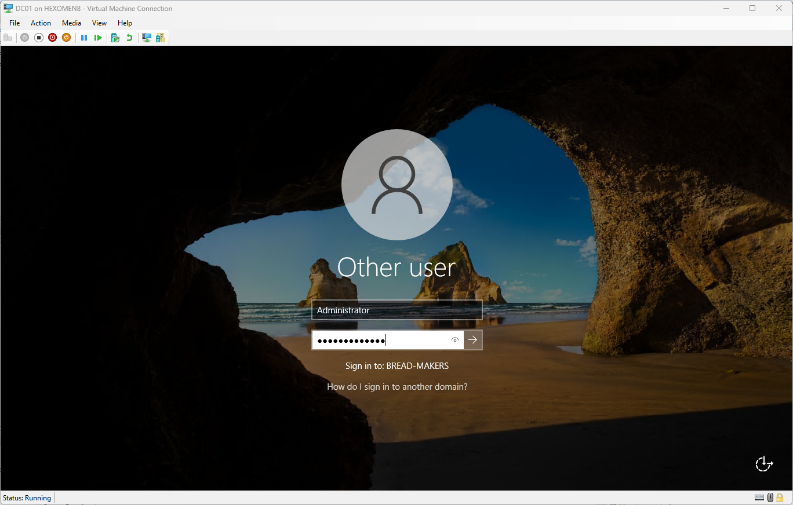

# Chapter 2: Installing and Configuring Active Directory Domain Services  
> This chapter will guide you through the process of installing and configuring **Active Directory Domain Services (AD DS)** on Windows Server 2022, and joining two Windows 10 virtual machines to the same domain.  
> The DNS service will be automatically installed along with AD DS, so no additional configuration is required.

---

## Assign Static IP Addresses to Both Domain Controllers

Setting static IP addresses for domain controllers is essential to ensure proper operation of DNS and AD services in an enterprise network environment.

### Steps:

1. Open `Control Panel` -> `Network and Internet` -> `Network and Sharing Center` -> `Change adapter settings`  
   Right-click the current local connection -> `Properties`

   

2. In the pop-up window, double-click `Internet Protocol Version 4 (TCP/IPv4)` and configure the following settings:

    | Device | IP Address      | Subnet Mask       | Default Gateway   | Preferred DNS | Alternate DNS |
    |--------|-----------------|-------------------|-------------------|---------------|----------------|
    | DC01   | `192.168.1.100` | `255.255.255.0`   | `192.168.1.101`   | Self          | DC02           |
    | DC02   | `192.168.1.101` | `255.255.255.0`   | `192.168.1.100`   | Self          | DC01           |
    | PC01   | `192.168.1.120` | `255.255.255.0`   | `192.168.1.100`   | DC01           | DC02           |
    | PC02   | `192.168.1.121` | `255.255.255.0`   | `192.168.1.100`   | DC01           | DC02           |

   

3. Click **OK** to save the settings, then open **Command Prompt** and enter the following command to verify the IP address configuration:

   ```cmd
   ipconfig
   ```

   

4. If the settings do not take effect, try disabling and re-enabling the network adapter:
   - Return to the "Change adapter settings" interface
   - Select the current network adapter
   - Click -> `Disable` -> `Enable`

   

---

## Install AD Domain Services (DC01)

1. Open `Server Manager` on DC01  
   Click `Manage` -> `Add Roles and Features` from the top menu

   

2. In the **Add Roles and Features Wizard**, keep the installation type as default and click `Next`

   

3. Keep the server selection as default and click `Next`

   

4. On the **Server Roles** page, check `Active Directory Domain Services`  
   Click `Add Features` when prompted

   

5. Keep the features selection as default and click `Next`

   

6. Leave the AD DS settings as default and continue clicking `Next`

   

7. Confirm your selections and click `Install`

   

8. After installation completes, a prompt appears saying **Promote this server to a domain controller** – click the link to continue

   

---

## Configure the Primary AD Domain Controller (DC01)

1. Enter the new domain name: `bread-makers.nz`, then click `Next`

   

2. Set the DSRM password (used for directory recovery), then click `Next`

   

3. Leave DNS settings as default and click `Next`

   

4. The domain name will be auto-filled, leave it as is and click `Next`

   

5. Leave the paths as default and click `Next`

   

6. Review the installation information and click `Next`

   

7. Once the prerequisite checks complete, click `Install`

   

8. After installation finishes, the system will automatically restart – click `Close` to confirm the reboot

   

9. After rebooting, log in using the domain administrator account

   

10. After logging in, you can see that the AD Domain Services have been successfully installed via Server Manager

   

---

## Configure the Secondary AD Domain Controller (DC02)

> The installation steps for the AD DS role are the same as for DC01 – refer to the previous section.

1. Click `Add a domain controller to an existing domain`, enter the domain name `bread-makers.nz`, and click `Next`

   

   > Note: You can view the domain administrator username on DC01:
   >
   > 

2. Enter the domain administrator password and click `OK`. After verification, click `Next`

   

3. Set the DSRM password and click `Next`

   

4. Leave DNS settings as default and click `Next`

   

5. Leave additional options as default and click `Next`

   

6. Leave the path settings as default and click `Next`

   

7. Confirm the installation settings and click `Next`

   

8. Once the prerequisite checks complete, click `Install`

   

9. After installation finishes, the system will automatically restart – log in using the domain administrator account after reboot

   

10. After logging in, open `Server Manager` -> `Tools` -> `Active Directory Users and Computers` on any domain controller. You should now see both domain controllers listed under the `bread-makers.nz` domain

   

---

## Summary

In this chapter, we completed the following tasks:

- Assigned static IP addresses to all devices
- Installed and configured the primary domain controller (DC01)
- Installed and joined the secondary domain controller (DC02) to the domain

In the next chapter, we will continue by setting up the **DHCP service** to allow clients to automatically obtain IP addresses.