# Active Directory 域服务安装配置
> 本章节将介绍如何在 Windows Server 2022 上安装和配置 Active Directory 域服务（AD DS），并将两台 Windows 10 虚拟机加入到同一个域中。  
> DNS 服务会自动随着 AD DS 一起安装，无需额外配置。

## 固定两台域控制器的 IP 地址

在搭建企业网络时，为域控制器设置静态 IP 地址是确保 DNS 和 AD 正常运行的前提条件。

1. 打开 `控制面板` -> `网络和 Internet` -> `网络和共享中心` -> `更改适配器设置`  
   右键点击当前使用的本地连接 -> `属性`

   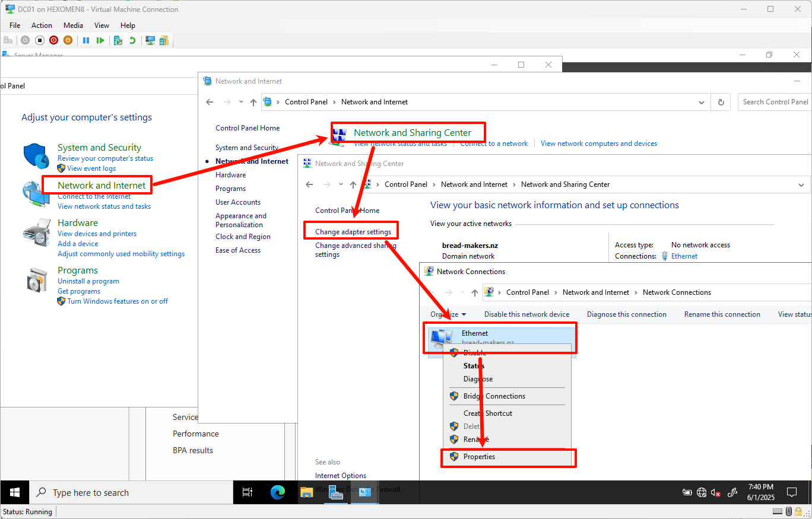

2. 在弹出窗口中双击 `Internet 协议版本 4 (TCP/IPv4)`，按如下表格设置 IP 地址、子网掩码、默认网关和 DNS：

    | 设备   | IP 地址           | 子网掩码            | 默认网关            | 首要DNS | 备用DNS |
    |------|-----------------|-----------------|-----------------|-------|-------|
    | DC01 | `192.168.1.100` | `255.255.255.0` | `192.168.1.101` | 自己    | DC02  |
    | DC02 | `192.168.1.101` | `255.255.255.0` | `192.168.1.100` | 自己    | DC01  |
    | PC01 | `192.168.1.120` | `255.255.255.0` | `192.168.1.100` | DC01  | DC02  |
    | PC02 | `192.168.1.121` | `255.255.255.0` | `192.168.1.100` | DC01  | DC02  |

   

3. 点击确定保存设置后，打开命令提示符，输入以下命令验证 IP 是否生效：

   ```cmd
   ipconfig
   ```

   

4. 如果未生效，可以尝试禁用再启用网络适配器：
   - 返回到“更改适配器设置”界面
   - 选中当前使用的网络适配器
   - 点击 -> `禁用` -> `启用`

   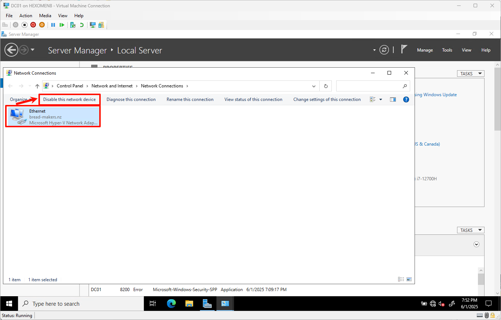

---

## 安装 AD 域服务器（DC01）

1. 打开 DC01 的 `服务器管理器`  
   点击顶部菜单中的 `管理` -> `添加角色和功能`

   

2. 在“添加角色和功能向导”中，安装类型选择默认选项，点击 `下一步`

   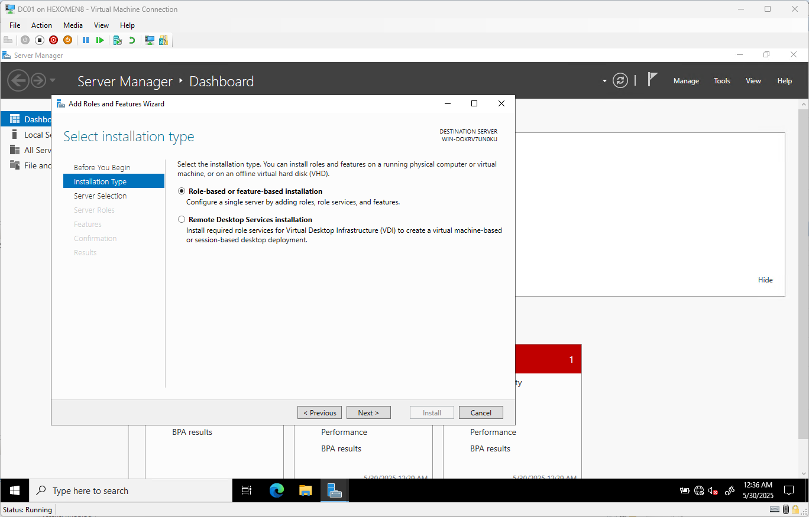

3. 服务器选择也保持默认，点击 `下一步`

   

4. 在“服务器角色”页面，勾选 `Active Directory 域服务`  
   在弹出窗口中点击 `添加功能`

   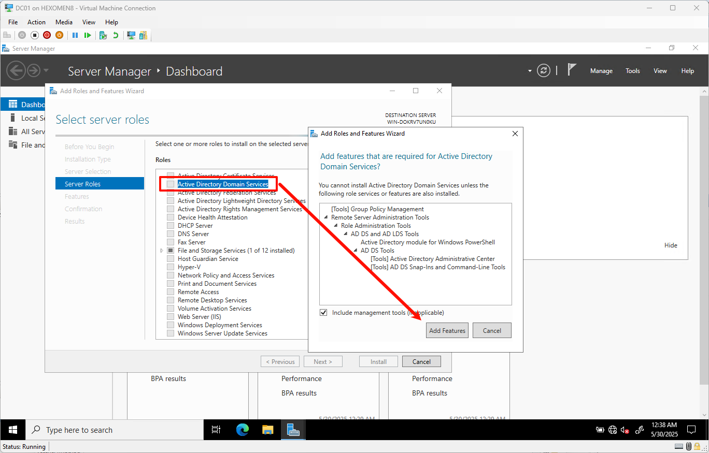

5. 功能选择保持默认，点击 `下一步`

   

6. AD DS 设置保持默认，继续点击 `下一步`

   

7. 确认无误后点击 `安装`

   

8. 安装完成后，提示“提升这台服务器为域控制器”，点击该链接继续操作

   

---

## 配置主 AD 域控制器（DC01）

1. 输入新域名 `bread-makers.nz`，点击 `下一步`

   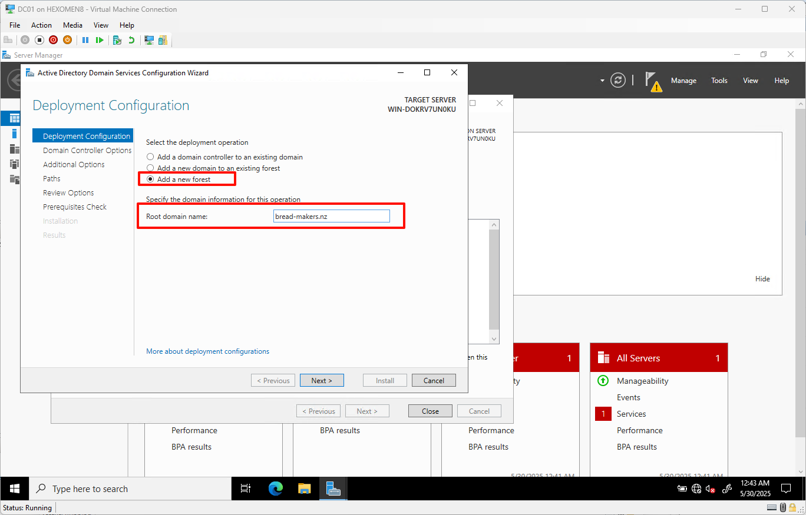

2. 设置 DSRM 密码（用于目录服务恢复），点击 `下一步`

   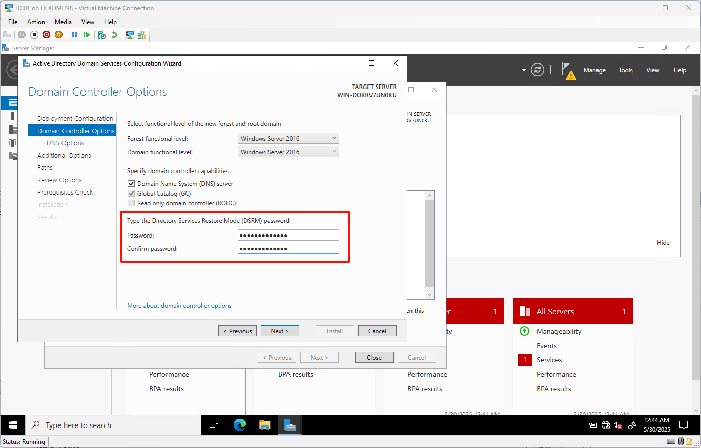

3. DNS 服务器设置保持默认，点击 `下一步`

   

4. 登录域名自动生成，保持默认即可，点击 `下一步`

   

5. 路径设置保持默认，点击 `下一步`

   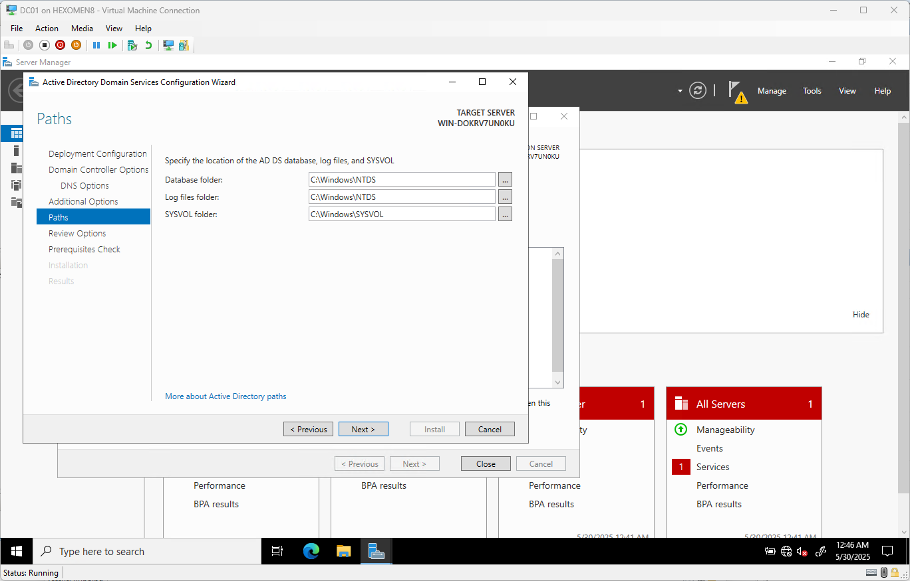

6. 检查并确认安装信息，点击 `下一步`

   

7. 完成需求检查后点击 `安装`

   

8. 安装完成后系统会自动重启，请点击 `关闭` 确认重启

   

9. 重启完成后使用域管理员账户登录

   

10. 登录后可以在服务器管理器中看到 AD 域服务已成功安装

    

---

## 配置副 AD 域控制器（DC02）

> 安装 AD DS 角色部分与 DC01 相同，可参考上方安装步骤。

1. 点击 `添加域控制器到现有域`，输入域名 `bread-makers.nz`，点击 `下一步`

   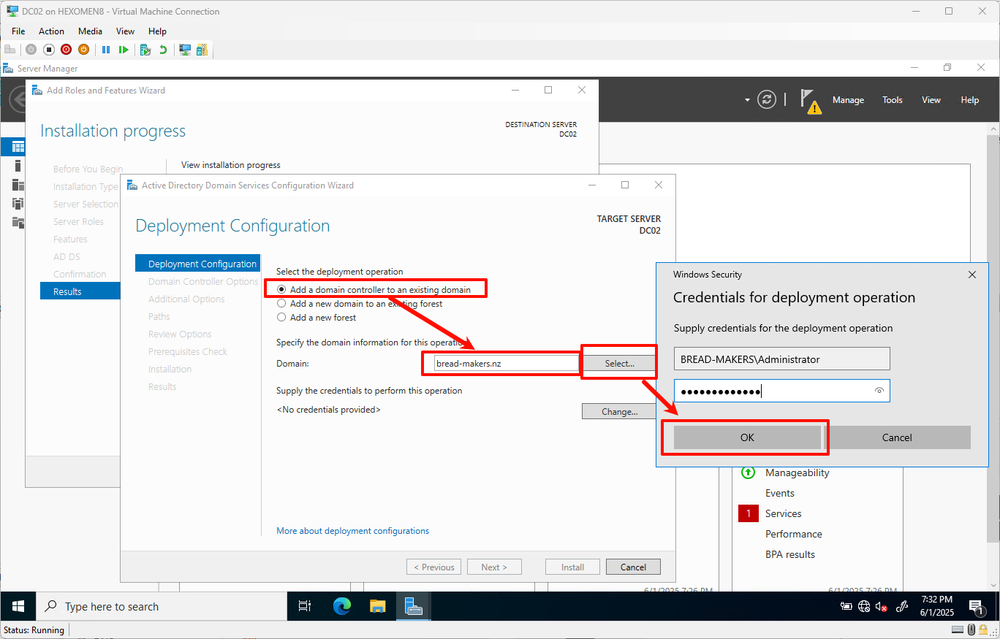

   > 注意：可在 DC01 上查看域管理员账户名：
   >
   > 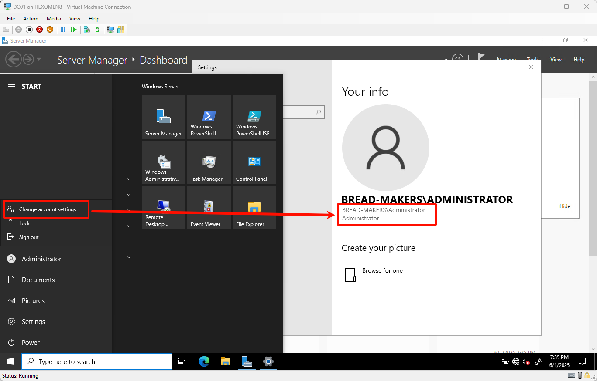

2. 输入域管理员账户密码后点击 `确定`，验证通过后点击 `确认`

   

3. 设置 DSRM 密码，点击 `下一步`

   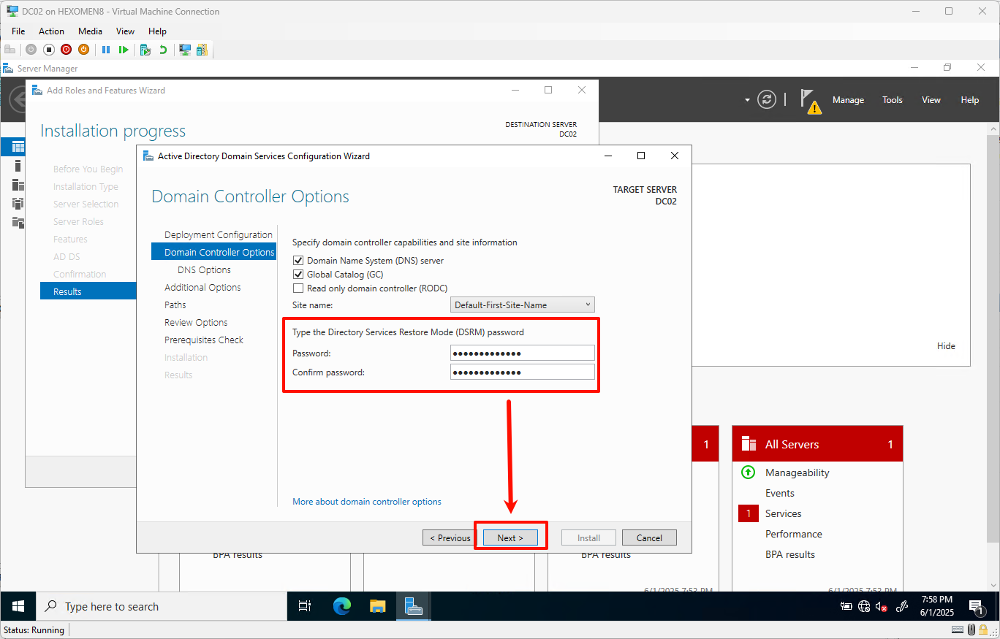

4. DNS 设置保持默认，点击 `下一步`

   

5. 额外选项保持默认，点击 `下一步`

   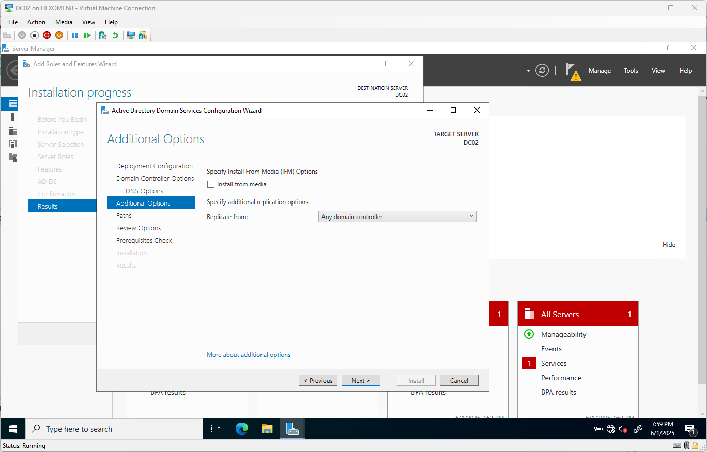

6. 路径设置保持默认，点击 `下一步`

   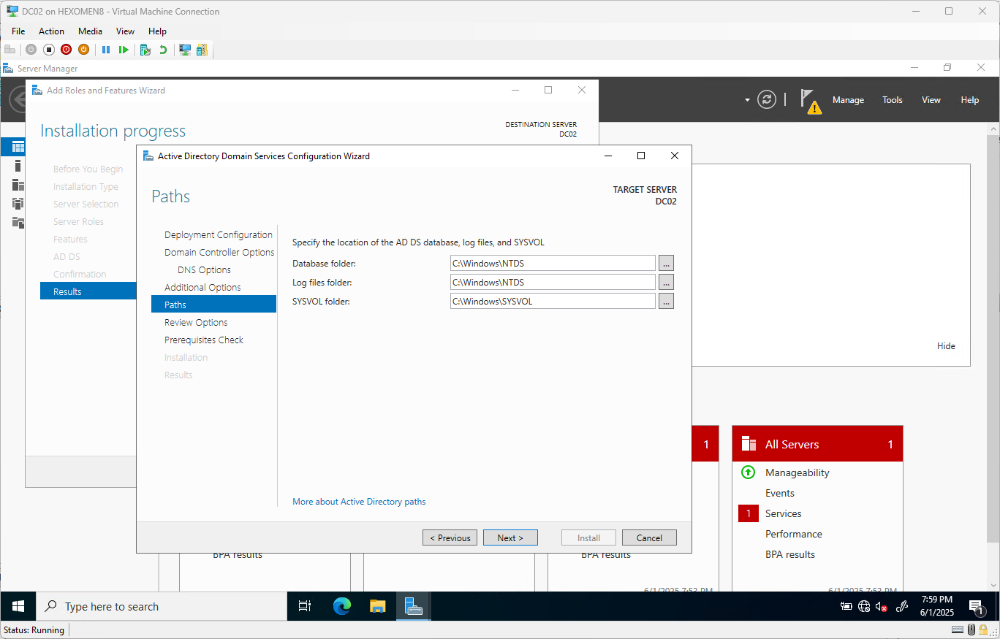

7. 确认安装信息后点击 `下一步`

   

8. 完成需求检查后点击 `安装`

   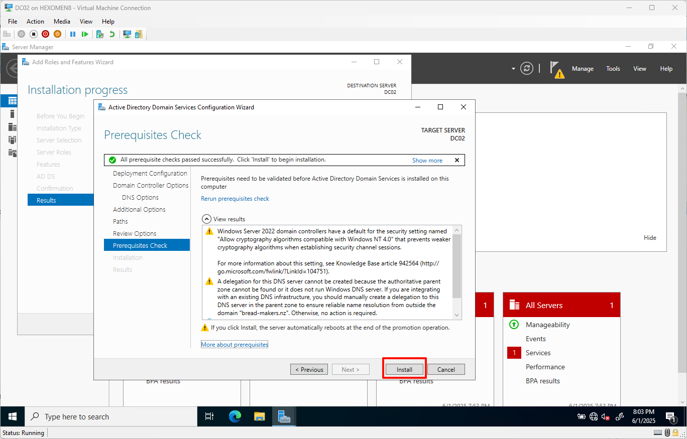

9. 安装完成后系统将自动重启，重启后使用域管理员账户登录

   

10. 登录后可在任意一台域控制器上打开 `服务器管理器` -> `工具` -> `AD 用户和计算机`，在左侧域列表中看到 `bread-makers.nz` 下已有两个域控制器

    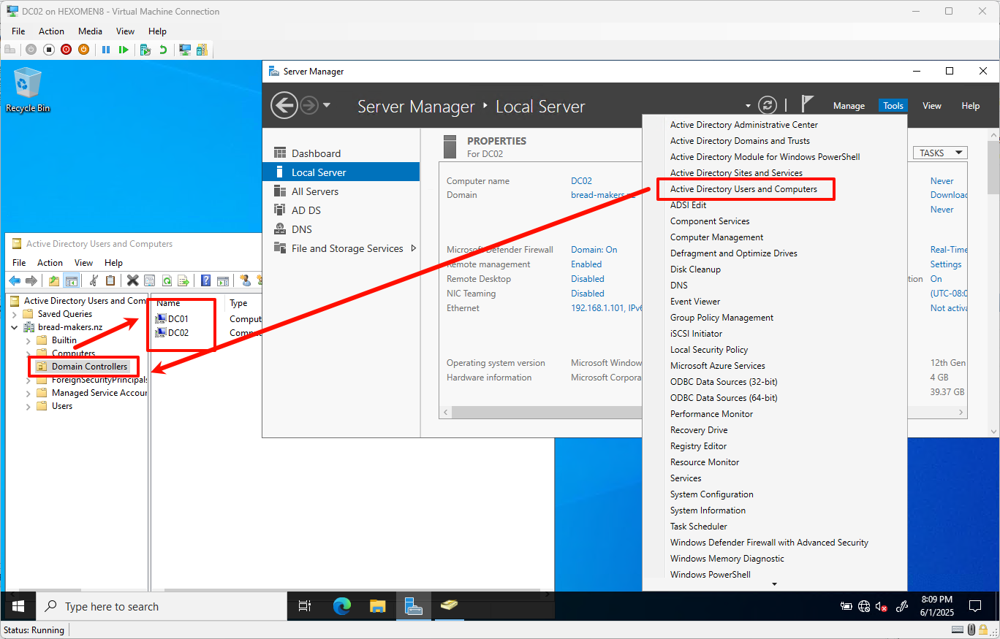

---

## 总结

本章完成了以下工作：

- 为所有设备设置了静态 IP 地址
- 安装并配置了主 AD 域控制器（DC01）
- 安装并加入了副 AD 域控制器（DC02）

下一章我们将继续配置 DHCP 服务，实现客户端自动获取 IP 地址的功能。