# 第三章：DHCP 服务器配置

> 在本章中，我们将使用 DHCP 服务为客户端自动分配 IP 地址以及实现故障转移，从而简化网络管理并实现高可用的网络环境。

## 安装 DHCP 功能

1. 打开 DC01 的 `服务器管理器`  
   点击顶部菜单中的 `管理` -> `添加角色和功能`

   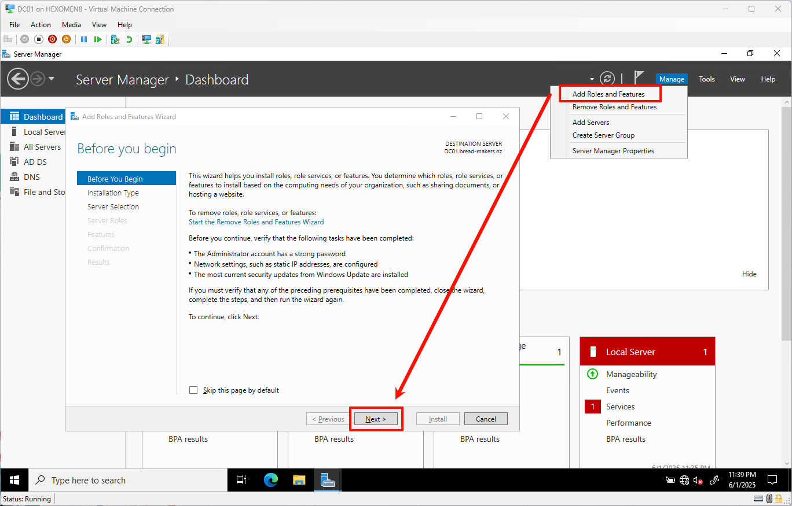

2. 在“添加角色和功能向导”中，选择左侧菜单中的 `服务器角色`，勾选 `DHCP 服务器`  
   在弹出窗口中点击 `添加功能`，然后继续点击 `下一步`

   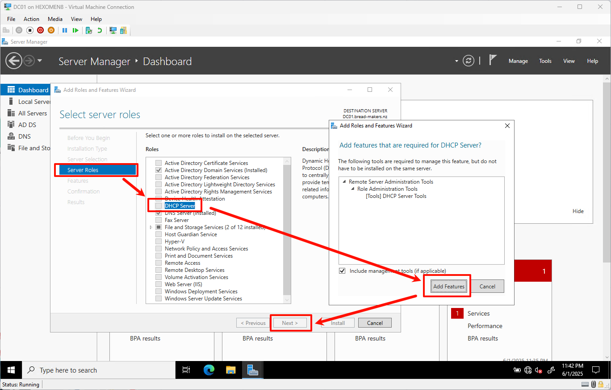

3. 进入确认页面后，点击 `安装` 开始安装 DHCP 角色

   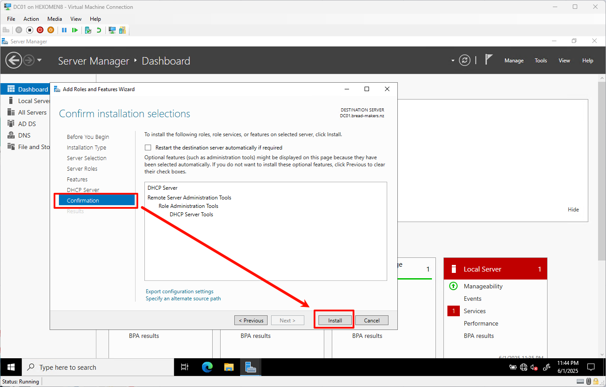

4. 安装完成后，点击 `完成 DHCP 配置` 继续后续设置

   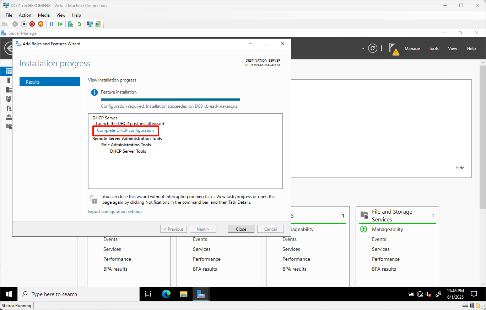

---

## 配置 DHCP 服务器

1. 在 `DHCP 配置向导` 页面中点击 `下一步`

   

2. 保持默认设置，点击 `提交` 完成基础配置

   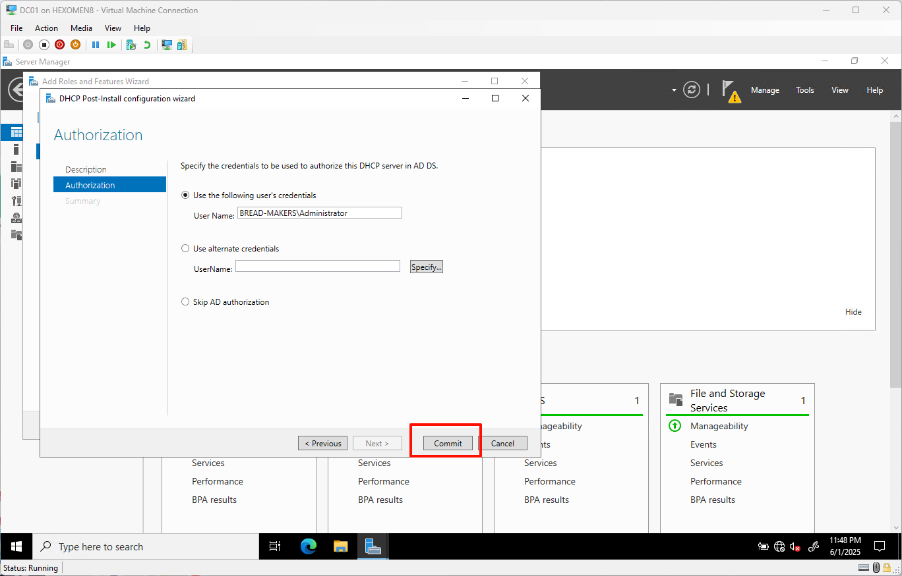

3. 配置完成后点击 `关闭`，进入下一步操作

   

---

## 配置主 DHCP 作用域（DC01）

1. 在服务器控制台中打开 `工具` -> `DHCP`

   

2. 右键点击 `IPv4`，选择 `新建作用域`，打开 `新建作用域向导` 窗口

   

3. 输入作用域名称，例如 `bread-makers DHCP`，点击 `下一步`

   

4. 设置 IP 地址范围：
   - 起始 IP：`192.168.1.100`
   - 结束 IP：`192.168.1.200`  
   点击 `下一步`

   

5. 设置排除地址范围：
   - 起始 IP：`192.168.1.100`
   - 结束 IP：`192.168.1.110`  
   （这部分用于保留给服务器等固定设备）  
   点击右侧 `添加` 按钮，将其加入排除列表，然后点击 `下一步`

   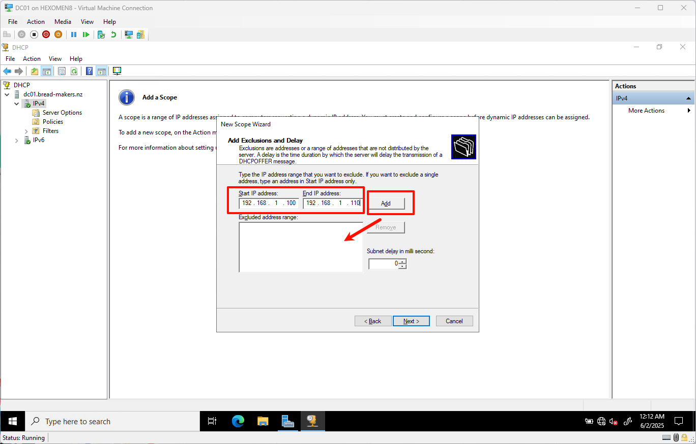

6. 租约期限保持默认（8 小时），点击 `下一步`

   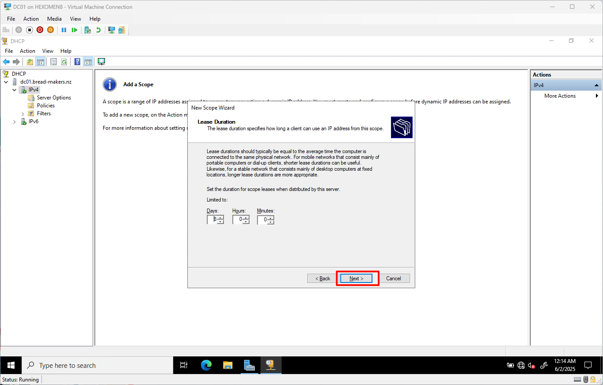

7. 选择是否配置 DHCP 选项，点击 `下一步`

   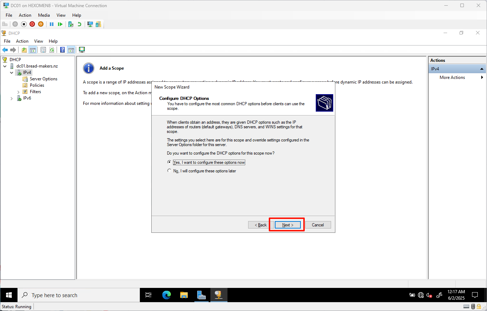

8. 设置路由器（默认网关）：
   - 添加两台域控制器的 IP 地址作为默认网关  
   - `192.168.1.100`（DC01）
   - `192.168.1.101`（DC02）  
   点击 `下一步`

   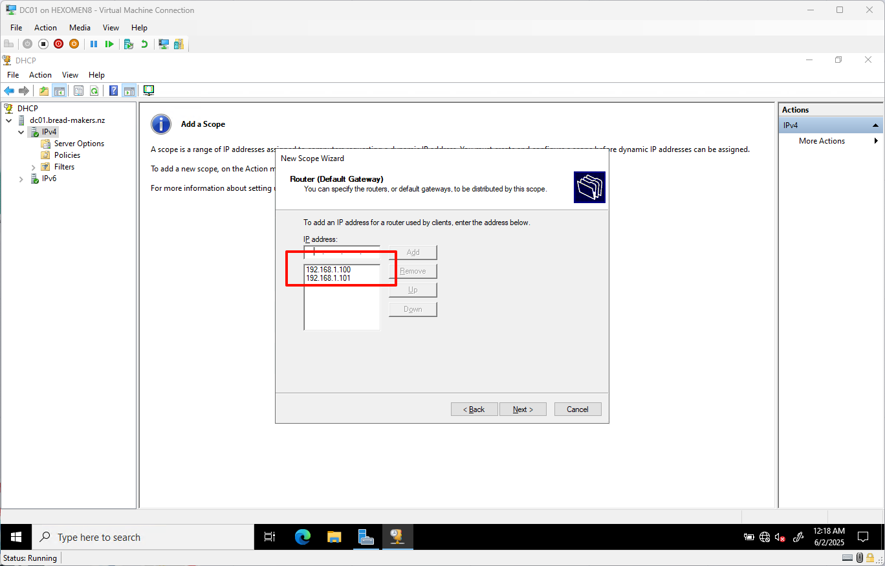

9. 域名和 DNS 服务器地址保持默认，点击 `下一步`

   

10. WINS 服务器地址保持默认，点击 `下一步`

    

11. 选择激活 DHCP 作用域，点击 `下一步`

    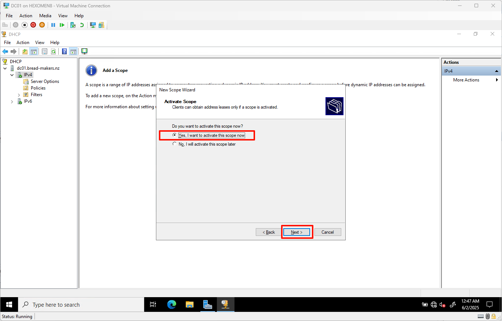

12. 向导完成，点击 `完成` 结束配置

    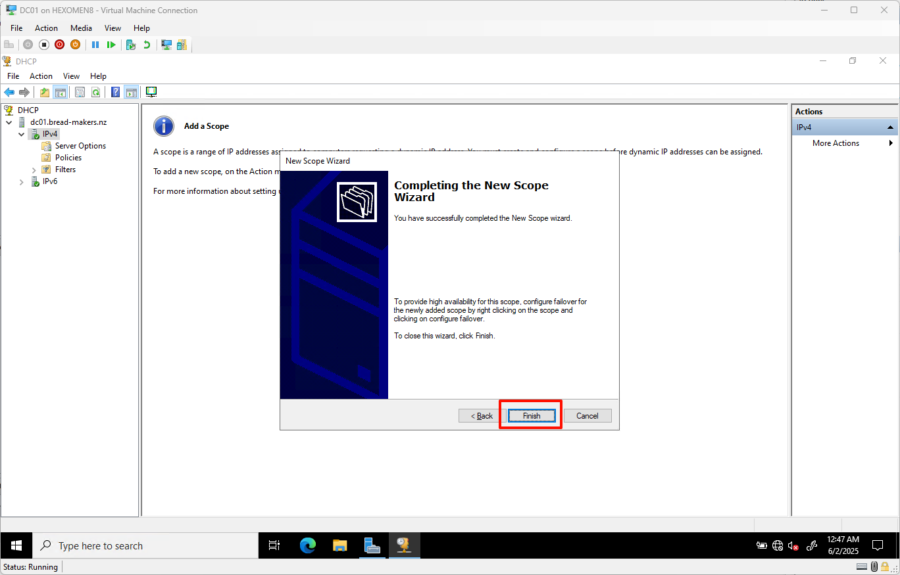

✅ **验证步骤**：

在 `DHCP` 管理界面中，展开 `bread-makers DHCP` -> `地址池`，可以看到已经成功创建了 `192.168.1.100-192.168.1.200` 的地址范围。

---

## 配置 DHCP 故障转移（DC01）

> 完成本节之前，请确保已在 DC02 上安装了 DHCP 服务器功能。可参考前面的安装步骤：
> - [安装 DHCP 功能](#安装-dhcp-功能)
> - [配置 DHCP 服务器](#配置-dhcp-服务器)

1. 在 DC01 上打开 `工具` -> `DHCP`

   

2. 右键点击 `IPv4`，选择 `配置故障转移`，打开 `配置故障转移向导` 窗口

   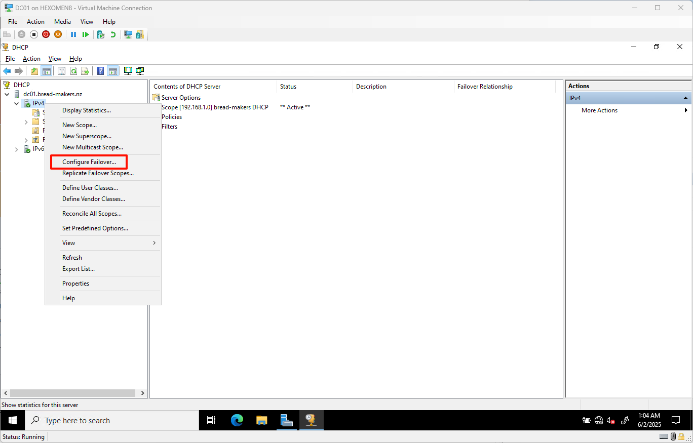

3. 由于当前只有一个 DHCP 作用域，它会自动被选中，点击 `下一步`

   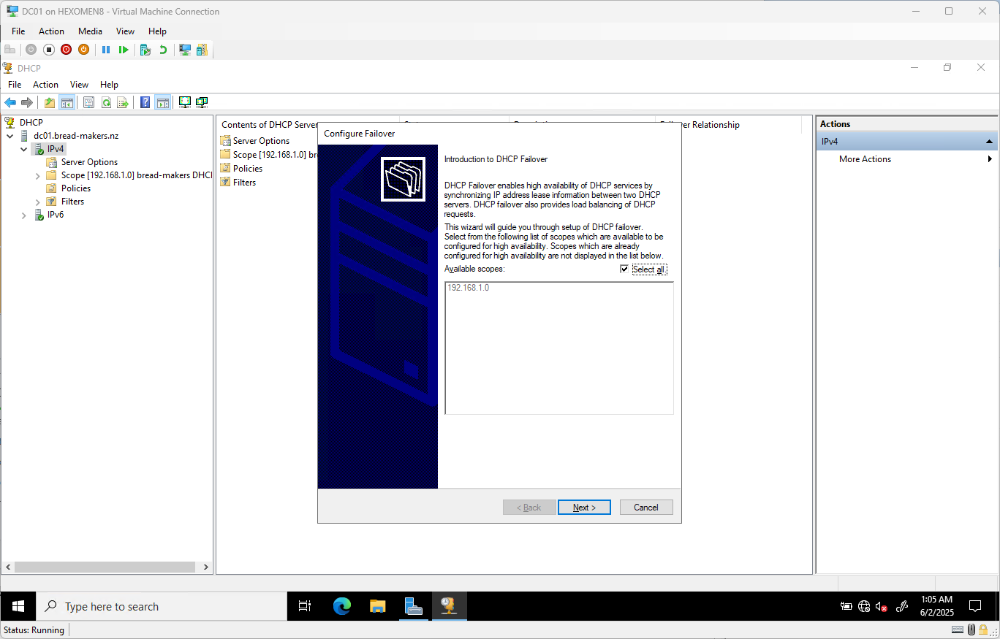

4. 在“选择伙伴服务器”页面，点击 `添加服务器` -> `浏览`，输入 `DC02`  
   点击 `检查` 确保所有选项卡状态正常，确认无误后点击 `下一步`

   

5. 设置共享密钥（建议使用强密码），用于安全通信，点击 `下一步`

   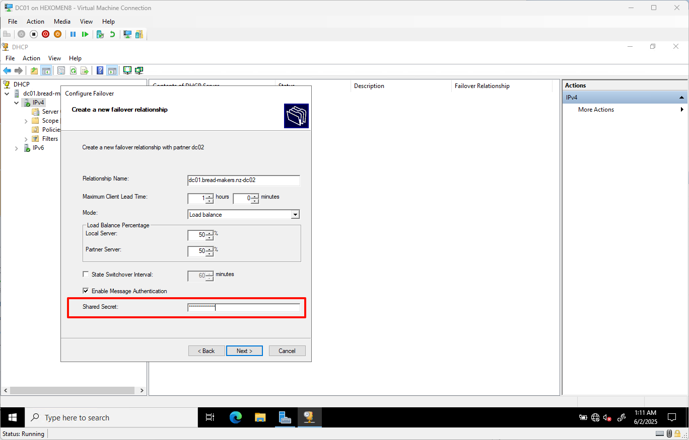

6. 查看配置摘要后点击 `完成`，结束向导

   

✅ **验证步骤**：

在 DC02 上打开 `DHCP` 管理器，展开 `bread-makers DHCP` -> `地址池`，可以看到同步过来的地址范围 `192.168.1.100-192.168.1.200`，说明故障转移已配置成功。

---

## 总结

在本章中，我们完成了以下任务：

- 在 DC01 上安装并配置了 DHCP 服务器
- 创建了一个 DHCP 作用域，并设置了地址池和排除范围
- 在 DC02 上配置了 DHCP 故障转移，实现了高可用性

下一章我们将介绍如何搭建 DFS（分布式文件系统），实现企业级的文件共享与存储管理。
