# Chapter 4: Configuring DFS File Sharing

> In enterprise environments, file sharing and storage management are critical tasks. In this chapter, we will use the **Distributed File System (DFS)** feature to configure **namespaces** and **replication** on DC01 and DC02, enabling a highly available file sharing service.

---

## Install DFS Role (on both DC01 and DC02)

1. Open `Server Manager` -> `Add Roles and Features`  
   On the **Server Roles** page, check the following two options:
   - **DFS Namespaces**
   - **DFS Replication**

   Click `Add Features`, then click `Next`

   

2. Proceed to the **Confirmation** panel and click `Install` to begin installation

   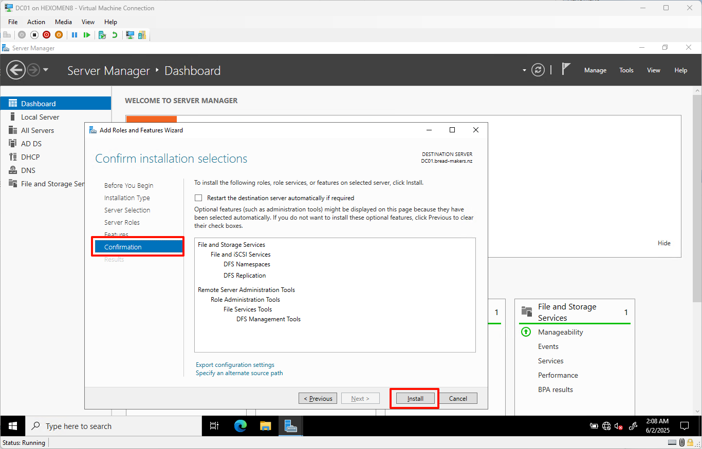

3. After installation completes, click `Close` to finish the process

   

---

## Configure DFS Namespace

1. On DC01, open `Server Manager` -> `Tools` -> `DFS Management`  
   Right-click on `Namespaces` on the left and select `New Namespace`

   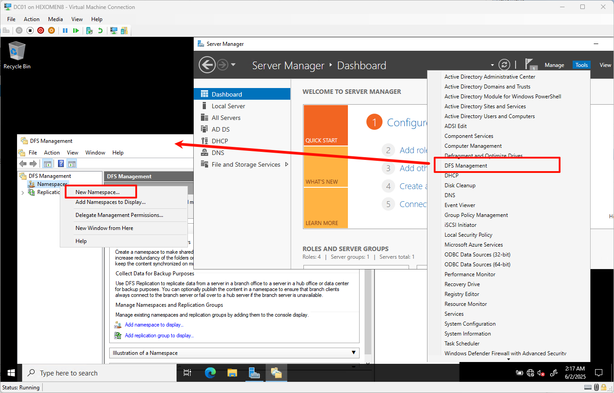

2. In the **New Namespace Wizard**, select DC01 as the host server and click `Next`

   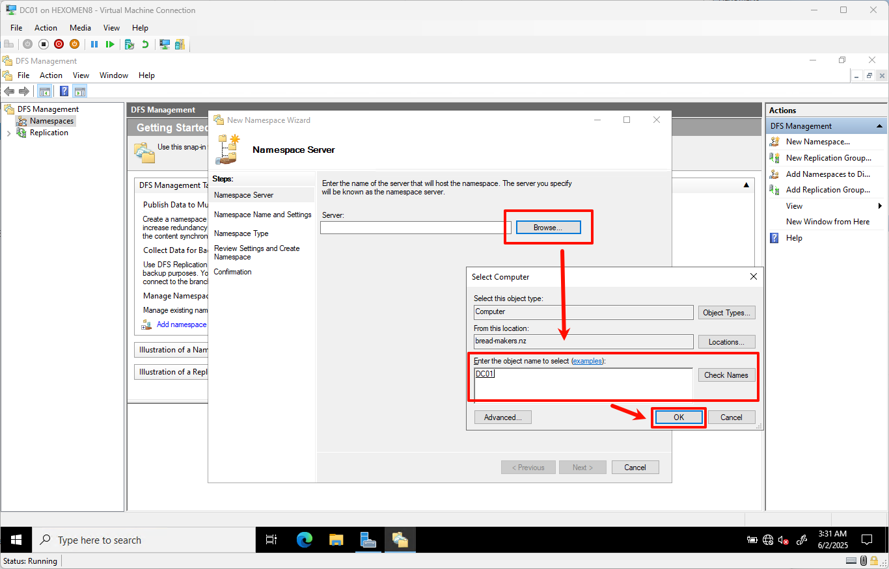

3. Enter a namespace name such as `bread-makers DFS`  
   Click `Edit Settings` to specify the physical path on the server (default is `C:\DFSRoots\Namespace Name`)  
   Choose share permissions based on your needs:
   - If users need read/write access, select **All users have read and write permissions**
   - For read-only access, choose **All users have read-only permissions**

   Click `Next` after configuration

   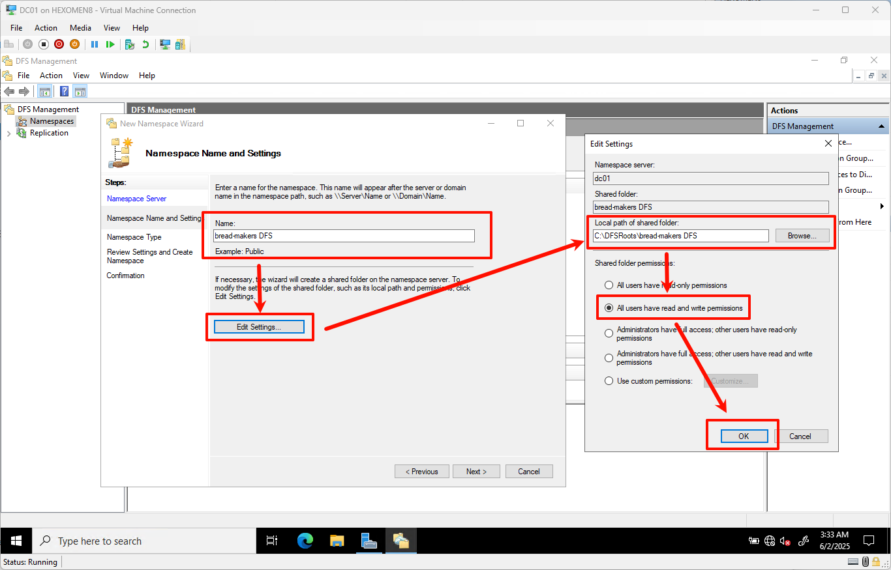

4. Leave the type as default (**Stand-Alone Namespace**) and click `Next`

   

5. Review the settings and click `Create`

   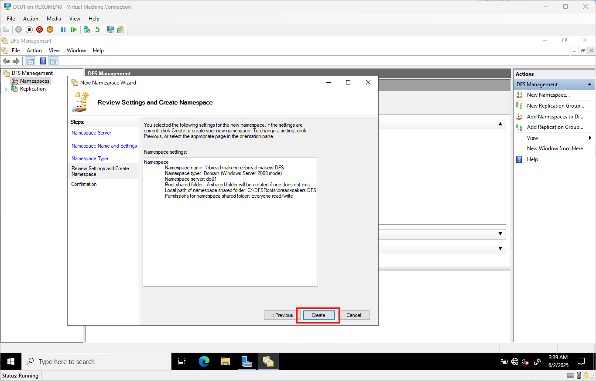

6. Once created, click `Close`

✅ **Verification Steps**:

- **Local File Path Verification**:  
  Open File Explorer and navigate to `C:\DFSRoots\bread-makers DFS` to see the physical folder associated with the namespace.

  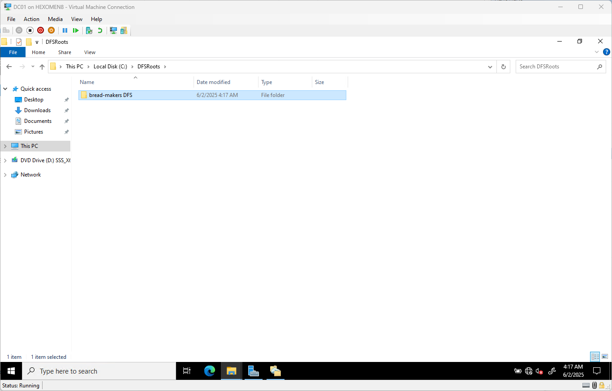

- **Network Access Verification**:  
  In the address bar of File Explorer, type `\\bread-makers.nz` and press Enter. You should see the newly created DFS shared directory.

  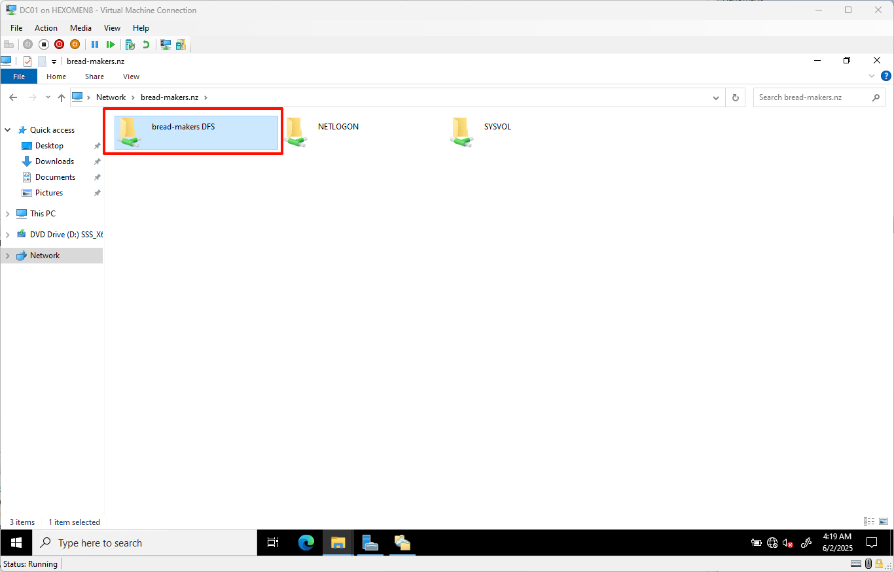

---

## Add Second DFS Namespace Server (DC02)

1. In `DFS Management` on DC01, right-click the previously created namespace and select `Add Namespace Server`

   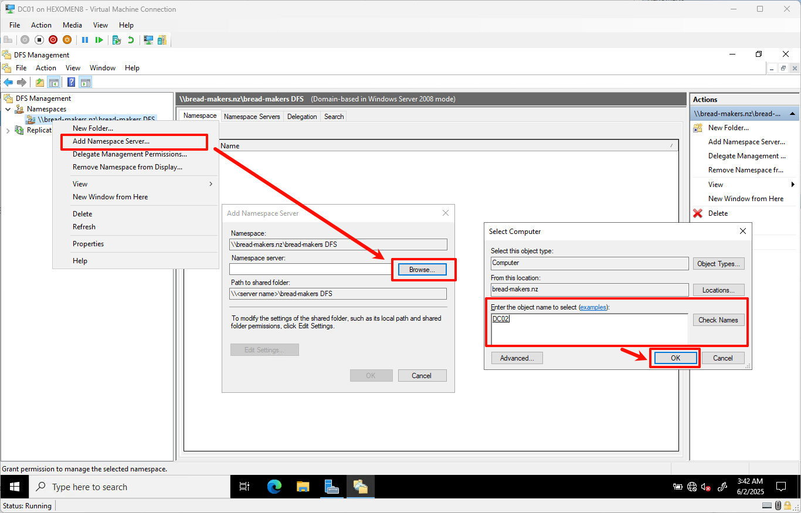

2. Click `Browse`, enter `DC02`, and click `Check` to verify server status  
   Click `Edit Settings` again, and set the same physical path (default is fine) and share permissions  
   After configuration, click all `OK` buttons to complete the addition

   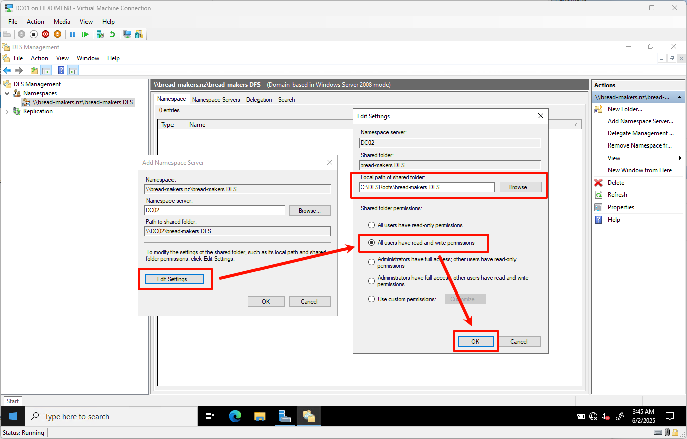

✅ **Verification Steps**:

- In the `DFS Management` window, go into the namespace and switch to the **Namespace** tab  
  You should now see both DC01 and DC02 listed under the namespace servers

  

- In File Explorer, type `\\bread-makers.nz` in the address bar and press Enter  
  Right-click the namespace folder -> `Properties` -> `DFS` tab  
  Check if information for both servers is displayed

  

🔧 **Tip: How to Fix Incorrect Permission Settings**:

If a server has incorrect share permissions, you can:
- Go to `DFS Management` -> `Namespace` tab
- Right-click the problematic server
- Select `Configure`
- Click `Share Permissions` to adjust the settings

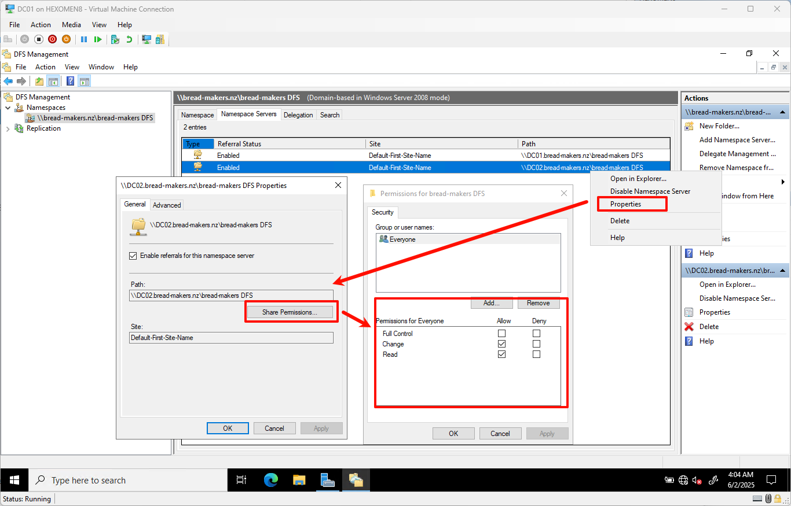

---

## Configure DFS Replication

> Currently, we've added multiple namespace servers, but their content is not yet synchronized. Next, we will configure **DFS Replication** to ensure that the namespace contents on DC01 and DC02 remain consistent.

1. Open `DFS Management` -> Right-click `Replication` -> `New Replication Group`

   

2. Enter a replication group name, such as `bread-makers DFS replication`, and click `Next`

   

3. On the **Select Replication Group Members** page, click `Add`  
   In the pop-up window, enter `DC01;DC02`, then click `Check` to confirm server status  
   After verification, click `Next`

   

4. Select the default replication topology (**Full Mesh**) and click `Next`

   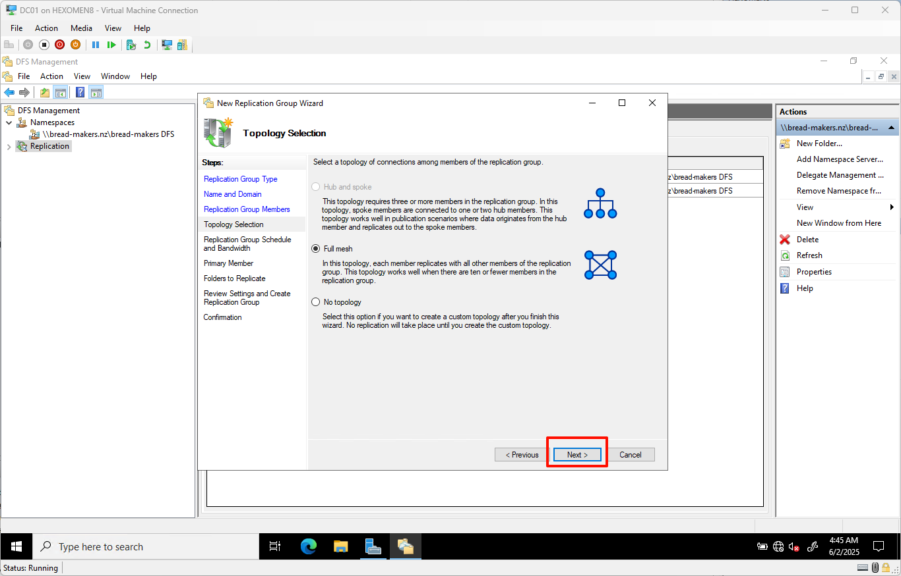

5. Keep replication group policies and bandwidth settings as default, click `Next`

   

6. Set `DC01` as the primary member and click `Next`

   

7. Add the folder path to be synchronized, e.g.:  
   `C:\DFSRoots\bread-makers DFS`  
   Click `Next`

   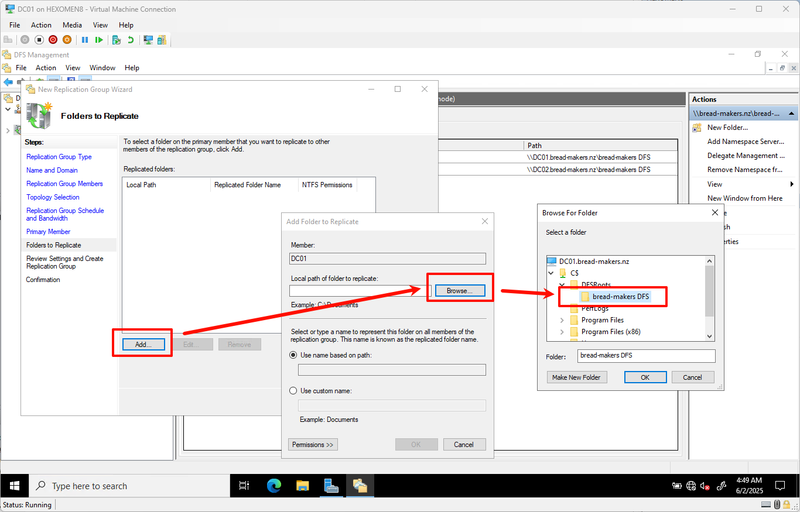

8. Set local storage paths for other members:
   - Select `DC02`
   - Click `Edit`
   - Enable replication and set the path to `C:\DFSRoots\bread-makers DFS`
   - Confirm all settings and click `Next`

   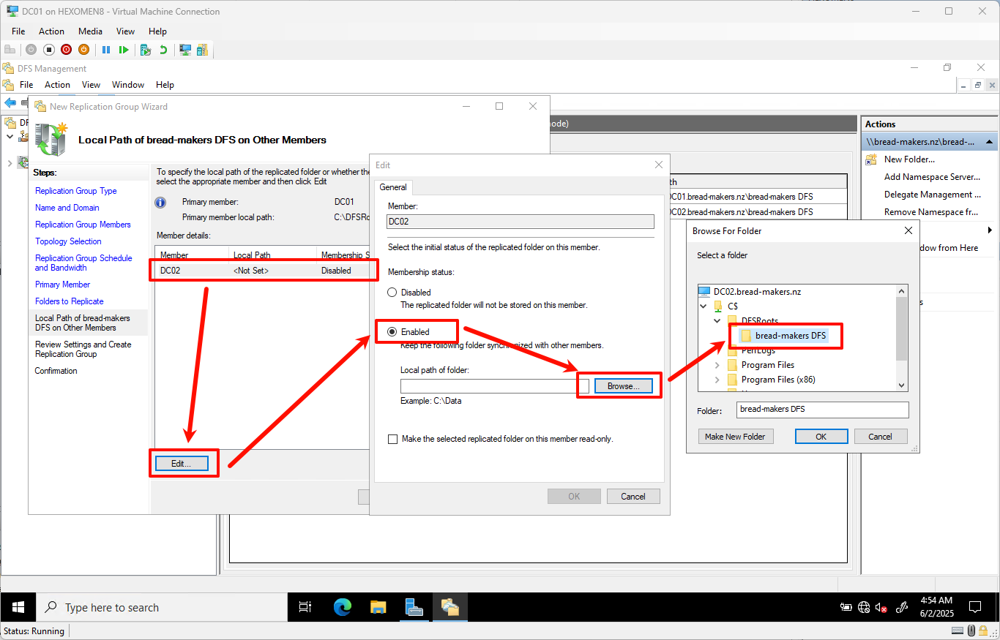

9. Review the configuration and click `Create`

   

10. After creation, click `Close`

    

11. The wizard displays a message:  
    > "Replication will not start until members of the replication group receive the configuration. This may take time depending on Active Directory Domain Services replication latency and polling intervals."  
    Click `OK` to continue

    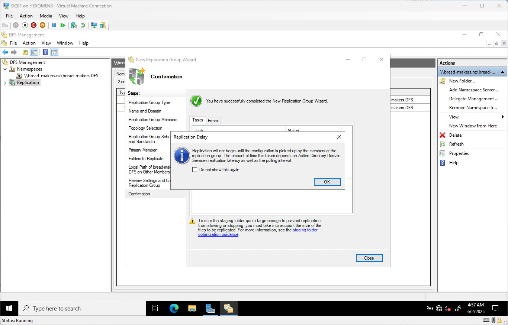

✅ **Verification Steps**:

- In `DFS Management` -> `Replication` tab, check the status and health of the replication group

  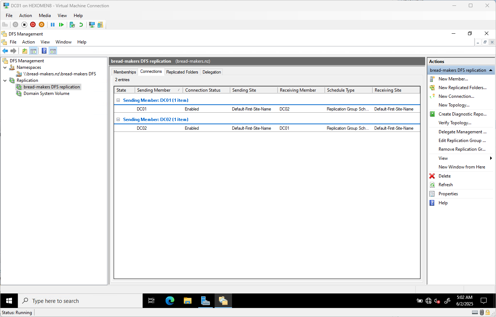

- Create or modify files in the shared folder, then switch the active DFS server (via the **Referrals** tab in DFS properties) and verify that the files have been synchronized

  

---

## Add Sample Files

Open File Explorer and extract or add the following sample files into the folder `C:\DFSRoots\bread-makers DFS`: [bread-makers DFS.zip](bread-makers%20DFS.zip)

These files will be used in the next chapter for further permission settings and usage examples.

---

## Summary

In this chapter, we completed the following tasks:

- Installed the DFS role on both DC01 and DC02
- Configured a DFS namespace to provide a unified network sharing entry
- Added a second namespace server (DC02)
- Set up DFS replication for cross-server file synchronization

In the next chapter, we will explore how to configure **Active Directory users and groups**, and use **PowerShell** for automated user creation, further improving domain environment management efficiency.