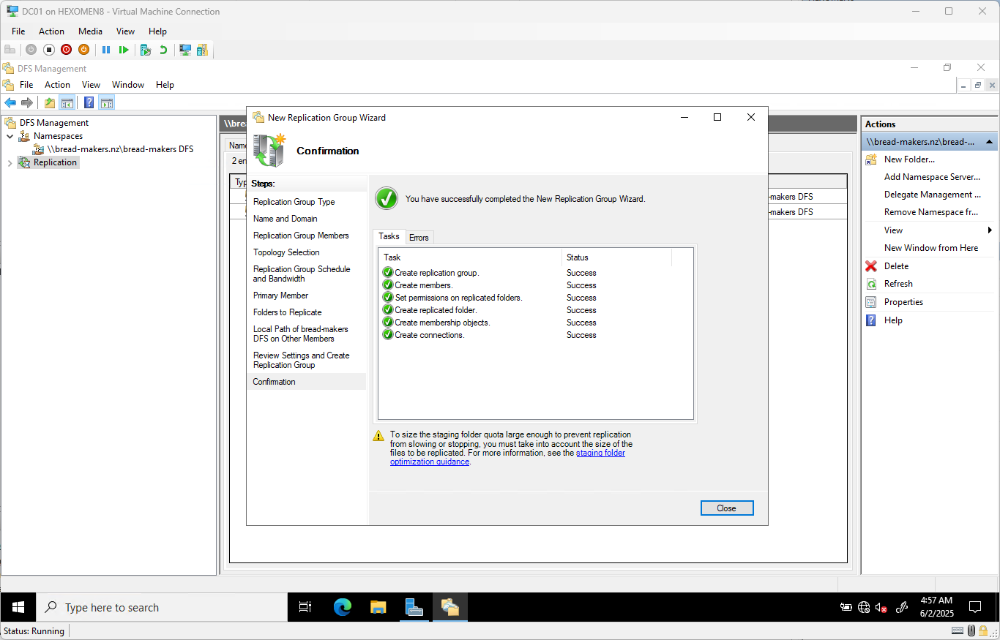

# 第四章：DFS 文件共享配置

> 在企业环境中，文件共享与存储管理是关键任务之一。本章我们将使用 DFS（Distributed File System）功能，在 DC01 和 DC02 上配置命名空间和复制功能，实现高可用的文件共享服务。

## 安装 DFS 功能（DC01 和 DC02 都要）

1. 打开 `服务器管理器` -> `添加角色和功能`  
   在“服务器角色”页面中，勾选以下两个选项：
   - **DFS 命名空间**
   - **DFS 复制**

   点击 `添加功能`，然后点击 `下一步`

   

2. 转到“确认”面板，点击 `安装` 开始安装

   

3. 安装完成后点击 `关闭` 结束安装流程

   

---

## 配置 DFS 命名空间

1. 在 DC01 上打开 `服务器管理器` -> `工具` -> `DFS 管理`  
   右键点击左侧的 `命名空间`，选择 `新建命名空间`

   

2. 在“新建命名空间向导”中，选择 DC01 作为主服务器，点击 `下一步`

   

3. 输入命名空间名称，例如 `bread-makers DFS`  
   点击 `编辑设置`，选择该命名空间在服务器上的物理路径（默认为 `C:\DFSRoots\命名空间名`）  
   根据需求选择共享权限：
   - 若需用户可读写，请选择 **所有用户都有读写权限**
   - 若为只读共享，则选择 **所有用户都有只读权限**

   设置完成后点击 `下一步`

   

4. 类型保持默认（独立命名空间），点击 `下一步`

   

5. 检查配置无误后点击 `创建`

   

6. 创建完成后点击 `关闭`

✅ **验证步骤**：

- **本地文件路径验证**：  
  打开资源管理器，前往 `C:\DFSRoots\bread-makers DFS`，可以看到命名空间对应的物理文件夹。

  

- **网络访问验证**：  
  在资源管理器地址栏输入 `\\bread-makers.nz` 并回车，即可看到新创建的 DFS 共享目录。

  

---

## 添加第二台 DFS 命名空间服务器（DC02）

1. 在 DC01 的 `DFS 管理` 中，右键之前创建的命名空间，选择 `添加命名空间服务器`

   

2. 点击 `浏览`，输入 `DC02`，点击 `检查` 确认服务器状态  
   再次点击 `编辑设置`，选择与 DC01 相同的物理路径（默认即可）和共享权限  
   设置完成后点击所有 `确定`，完成添加

   

✅ **验证步骤**：

- 在 `DFS 管理` 页面中，进入命名空间并切换到 `命名空间` 选项卡  
  可以看到 DC01 和 DC02 都已加入命名空间列表

  

- 在资源管理器的地址栏中输入 `\\bread-makers.nz` 并回车，右键命名空间文件夹 -> `属性` -> `DFS` 选项卡  
  查看是否显示两台服务器的信息

  

🔧 **提示：修改错误权限设置的方法**：

如果某台服务器的共享权限设置有误，可以在 `DFS 管理` -> `命名空间` 选项卡中：
- 右键出错的服务器
- 选择 `配置`
- 点击 `共享权限` 修改权限设置

---

## 配置 DFS 复制

> 当前我们已经添加了多台命名空间服务器，但它们之间的文件内容并未同步。接下来我们将配置 DFS 复制功能，使 DC01 和 DC02 上的命名空间内容保持一致。

1. 打开 `DFS 管理` -> 右键点击 `复制` -> `新建复制组`

   

2. 输入复制组名称，例如 `bread-makers DFS replication`，点击 `下一步`

   

3. 在“选择复制组成员”页面中，点击 `添加`  
   在弹出窗口中输入 `DC01;DC02`，点击 `检查` 确认服务器状态  
   完成后点击 `下一步`

   

4. 选择默认的复制拓扑（全网状），点击 `下一步`

   

5. 复制组策略和带宽设置保持默认，点击 `下一步`

   

6. 主要服务器选择 `DC01`，点击 `下一步`

   

7. 添加需要同步的文件夹路径，例如：  
   `C:\DFSRoots\bread-makers DFS`  
   点击 `下一步`

   

8. 为其他成员设置本地存储路径：
   - 选中 `DC02`
   - 点击 `编辑`
   - 启用复制，并将路径设为 `C:\DFSRoots\bread-makers DFS`
   - 确认所有设置后点击 `下一步`

   

9. 检查配置信息无误后点击 `创建`

   

10. 创建完成后点击 `关闭`

    

11. 配置向导会提示：  
    > “在复制组的成员获取配置之前，复制不会开始。这所需的时间取决于 Active Directory 域服务的复制延迟以及轮询间隔。”  
    点击 `确认` 继续

    

✅ **验证步骤**：

- 在 `DFS 管理` -> `复制` 选项卡中，查看复制组的状态和健康情况

  

- 在共享文件夹中新建或修改文件后，再次切换激活的 DFS 服务器（通过 DFS 属性中的“首选目标”），观察文件是否已同步

  

---

## 总结

在本章中，我们完成了以下任务：

- 在 DC01 和 DC02 上安装了 DFS 角色
- 配置了 DFS 命名空间，实现了统一的网络共享入口
- 添加了第二台命名空间服务器（DC02）
- 配置了 DFS 复制，实现了跨服务器的文件同步

下一章我们将介绍如何配置 AD 用户和组，并使用 PowerShell 实现自动化用户创建，进一步提升域环境的管理效率。
