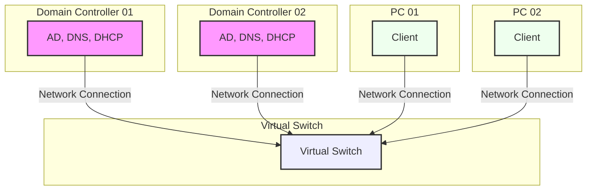

English | [简体中文](README_zh-hans.md)

# Enterprise Network Setup with Windows Server

    
    
    
    

---

A comprehensive lab guide for building a full-scale enterprise network environment using:

- 💻 **Windows 10/11 Pro**
  - 🤖 **Hyper-V**
    - 💻 **DC01** (Windows Server 2022)
    - 💻 **DC02** (Windows Server 2022)
    - 💻 **PC01** (Windows 10)
    - 💻 **PC02** (Windows 10) *(Optional)*

This project walks you through the entire process of setting up a simulated enterprise network from scratch, including domain services, user management, file sharing, and automation via PowerShell.

---

## 📚 Table of Contents

1. [Requirements & Prerequisites](#requirements--prerequisites)
2. [Getting Started](#getting-started)
3. [Chapters](#chapters)
4. [Contributing / Feedback](#contributing--feedback)

---

## Requirements & Prerequisites

- Windows 10 Pro or later (to enable Hyper-V)
- At least 16GB RAM (32GB recommended)
- Hyper-V enabled
- ISO files for Windows Server 2022 and Windows 10
  - [Windows Server 2022 ISO](https://www.microsoft.com/evalcenter/download-windows-server-2022)
  - [Windows 10 ISO](https://www.microsoft.com/software-download/windows10ISO)
- Basic knowledge of networking and Windows Server

---

## Getting Started

1. Enable Hyper-V on your Windows 10 machine
2. Download Windows Server 2022 ISO and Window 10 ISO
3. Follow the guides in each folder in order

---

## Chapters

| Chapter | Topic                                                                                      |
|---------|--------------------------------------------------------------------------------------------|
| 01      | 🖥️ [Virtual Machine Setup using Hyper-V](01_VM_Setup/README.md)                           |
| 02      | 🔐 [Active Directory Domain Services (AD DS) Setup](02_AD_Domain/README.md)                |
| 03      | 📡 [DHCP Server Configuration](03_DHCP_Server/README.md)                                   |
| 04      | 📁 [DFS (Distributed File System) for File Sharing](04_DFS_File_Sharing/README.md)         |
| 05      | 👥 [AD User & Group Management + PowerShell Automation](05_Auto_User_Management/README.md) |

---

## Contributing / Feedback

Feel free to open issues or pull requests if you have suggestions, corrections, or want to contribute additional chapters!
