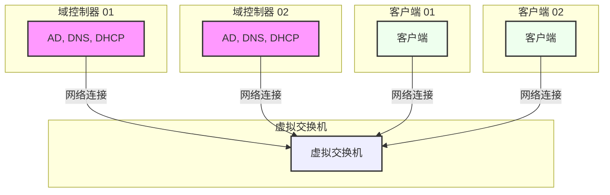

[English](README.md) | 简体中文

# 使用 Windows Server 构建企业网络环境

    
    
    

---

一个完整的实验指南，教你从零开始搭建一个完整的企业网络环境，包括以下组件：

- 💻 **Windows 10/11 Pro**
  - 🤖 **Hyper-V**
    - 💻 **DC01** (Windows Server 2022)
    - 💻 **DC02** (Windows Server 2022)
    - 💻 **PC01** (Windows 10)
    - 💻 **PC02** (Windows 10) *(可选)*

该项目详细指导你如何从头开始配置一个模拟的企业网络环境，包括域服务、用户管理、文件共享以及通过 PowerShell 实现自动化。

---

## 📚 目录

1. [需求与前提条件](#需求--前提条件)
2. [开始之前](#开始之前)
3. [章节列表](#章节列表)
4. [贡献 / 反馈建议](#贡献--反馈建议)

---

## 需求 & 前提条件

- Windows 10 Pro 或更高版本（以启用 Hyper-V）
- 至少 16GB 内存（推荐 32GB）
- 已启用 Hyper-V
- Windows Server 2022 和 Windows 10 的 ISO 文件
  - [Windows Server 2022 ISO](https://www.microsoft.com/evalcenter/download-windows-server-2022)  
  - [Windows 10 ISO](https://www.microsoft.com/software-download/windows10ISO)  
- 网络和 Windows Server 的基础知识

> ⚠️ 注意：上述 Microsoft 页面目前无法访问，请尝试其他方式获取 ISO 文件，如通过官方评估中心或 MSDN。

---

## 开始之前

1. 在你的 Windows 10 设备上启用 Hyper-V
2. 下载 Windows Server 2022 ISO 和 Windows 10 ISO
3. 按顺序阅读每个文件夹中的指南并操作

---

## 章节列表

| 章节 | 主题                                                                 |
|----|--------------------------------------------------------------------|
| 01 | 🖥️ [使用 Hyper-V 创建虚拟机](01_VM_Setup/README.md)                      |
| 02 | 🔐 [Active Directory 域服务安装配置](02_AD_Domain/README.md)              |
| 03 | 📡 [DHCP 服务器配置](03_DHCP_Server/README.md)                          |
| 04 | 📁 [DFS（分布式文件系统）实现文件共享](04_DFS_File_Sharing/README.md)             |
| 05 | 👥 [AD 用户与组管理 + PowerShell 自动化](05_Auto_User_Management/README.md) |

---

## 贡献 / 反馈建议

如果你有任何建议、发现错误或希望贡献新的章节，请随时提交 Issues 或 Pull Requests！
